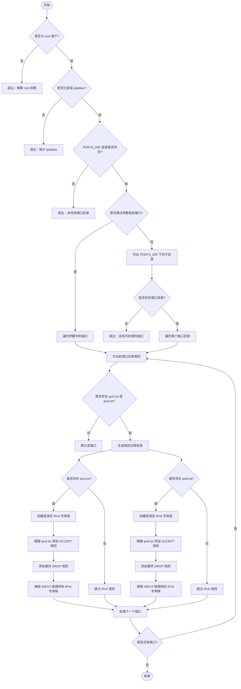

# ip_allow.sh
```
██╗██████╗      █████╗ ██╗     ██╗      ██████╗ ██╗    ██╗
██║██╔══██╗    ██╔══██╗██║     ██║     ██╔═══██╗██║    ██║
██║██████╔╝    ███████║██║     ██║     ██║   ██║██║ █╗ ██║
██║██╔═══╝     ██╔══██║██║     ██║     ██║   ██║██║███╗██║
██║██║         ██║  ██║███████╗███████╗╚██████╔╝╚███╔███╔╝
╚═╝╚═╝         ╚═╝  ╚═╝╚══════╝╚══════╝ ╚═════╝  ╚══╝╚══╝
```
自动化添加端口ip白名单的工具。
对iptables进行自动化操作。

## 脚本说明
在命令执行的目录下需要有`ports/xxx/ipv4.txt`或`ports/xxx/ipv6.txt`。
其中：
- `xxx`是想要设置白名单的端口
- `ipv4.txt`文件中，每行一条`ip`（例`127.0.0.1`）或者一个`CIDR`（例`192.168.0.0/24`）
- `ipv6.txt`同理
- ip文件中，允许`#`开头的注释

运行脚本时，会：
- 自动读取`ports/xxx/ipv4.txt`和`ports/xxx/ipv6.txt`
- 将`xxx`端口设置为默认`drop`丢弃，然后将ip文件中的每一行加入允许通过的白名单。

## 用法：
```bash
bash ipallow_cn.sh -h|--help                  # 显示帮助/版本信息
sudo bash ipallow_cn.sh <port> [port2 ...]    # 仅应用指定端口白名单
sudo bash ipallow_cn.sh                       # 应用 ./ports 下全部端口白名单
sudo bash ipallow_cn.sh show                  # 从当前 iptables/ip6tables 规则展示统计
sudo bash ipallow_cn.sh delete [port ...]     # 删除本脚本添加的端口白名单
```

###  1. 显示帮助：
```bash
bash ipallow_cn.sh -h|--help                  # 显示帮助/版本信息
```

### 2. 应用指定/所有端口白名单
#### 应用指定端口白名单
```bash
sudo bash ipallow_cn.sh <port> [port2 ...]    # 仅应用指定端口白名单
```

样例：应用`443`和`8080`端口，`./ports/443/ipv4.txt`和`./ports/443/ipv6.txt`已有ip信息，`8080`同理。
```
root@simple:~/ip-allow# sudo bash ipallow_cn.sh 443 8080
端口 443 IPv4 白名单已刷新，规则链：IPALLOW_443（已添加：196，已跳过：0）
端口 443 IPv6 白名单已刷新，规则链：IPALLOW6_443（已添加：90，已跳过：0）
端口 8080 IPv4 白名单已刷新，规则链：IPALLOW_8080（已添加：197，已跳过：0）
端口 8080 IPv6 白名单已刷新，规则链：IPALLOW6_8080（已添加：90，已跳过：0）
```

#### 应用所有端口白名单
```bash
sudo bash ipallow_cn.sh                       # 应用 ./ports 下全部端口白名单
```

如果`ports/`文件夹下有`443`和`8080`和`8443`, 此命令会同时添加三个端口的白名单。

### 3. 展示本脚本已添加的白名单规则
```bash
sudo bash ipallow_cn.sh show                  # 从当前 iptables/ip6tables 规则展示统计
```

会从iptables中读取。
样例：读取已写入的所有端口：

```
root@simple:~/ip-allow# sudo bash ipallow_cn.sh show
端口   IPv4数量 IPv6数量
443      196        90        
8080     197        90   
```

### 4. 删除指定/所有端口白名单
#### 删除指定端口白名单
```bash
sudo bash ipallow_cn.sh delete [port ...]     # 删除本脚本添加的端口白名单
```

会提示是否删除。
样例：

```
root@simple:~/ip-allow# sudo bash ipallow_cn.sh delete 443
是否确认清除443端口ip白名单？[y/N] y
已删除443端口：共292条
```

#### 删除所有端口白名单
```bash
sudo bash ipallow_cn.sh delete                # 删除本脚本添加的所有端口白名单
```

会提示是否删除。
样例：
```
root@simple:~/ip-allow# sudo bash ipallow_cn.sh delete
是否确认清除所有本脚本添加的端口ip白名单？[y/N] y
已删除443端口：共292条
已删除8080端口：共293条
共删除2个端口的白名单
```

## 意义何在？
cdn厂商会提供源站防护，可以设置只允许这些回源ip，来检测或防止对网站源站的ddos等攻击


用本脚本可以快速设置白名单。

## 代码逻辑

